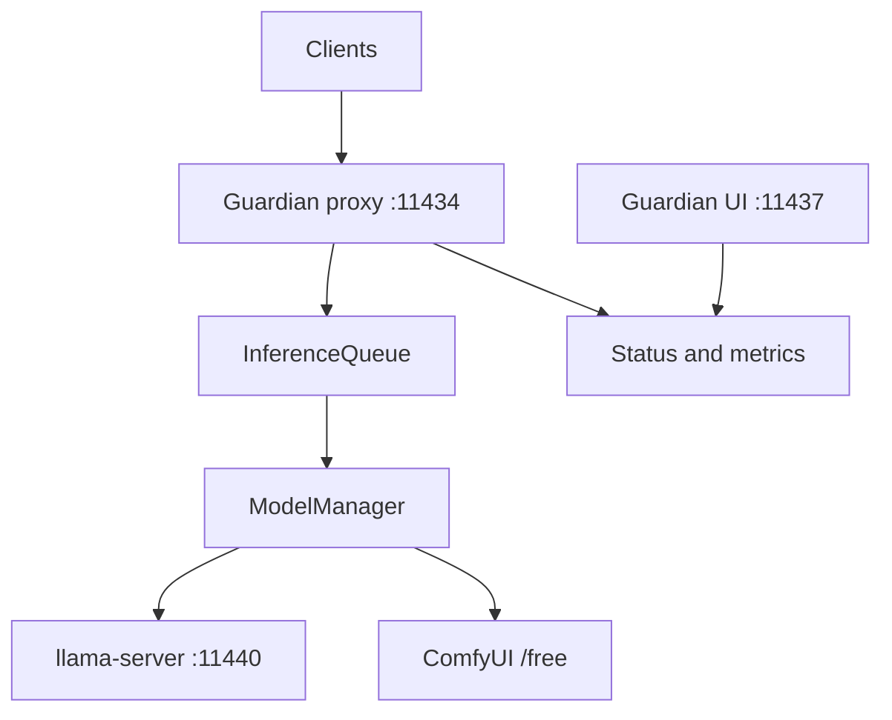
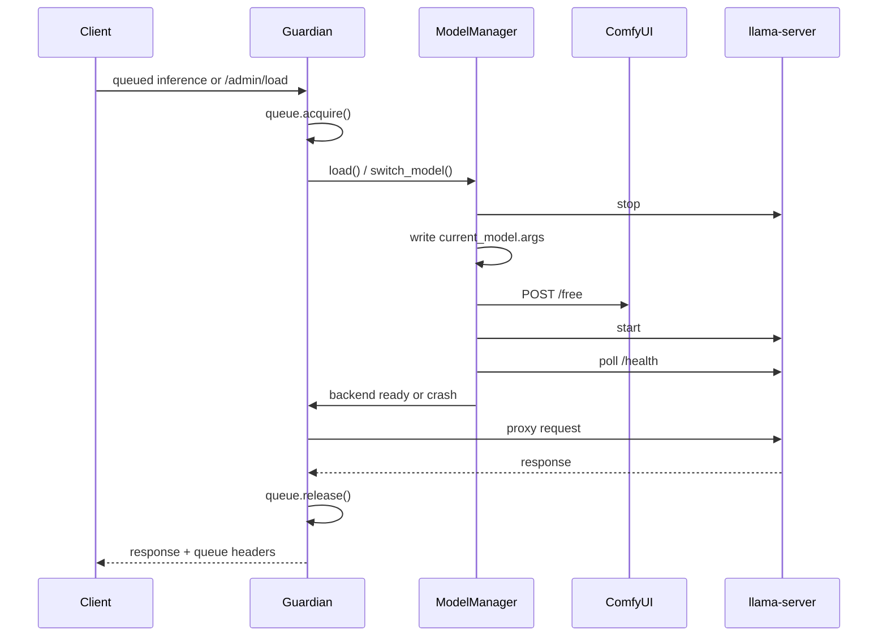

# Llama-CPP Guardian Architecture

## Overview

Guardian is not a thin API proxy. It is the control plane for a single shared
`llama-server` backend on a host where multiple GPU-heavy tenants compete for
the same VRAM budget.

The current runtime is built around three distinct scheduling layers:

1. `InferenceQueue` is the real hot-path admission gate for inference.
2. `ModelManager` owns backend start, stop, switch, unload, crash detection,
   and runtime argument generation.
3. `SchedulerManager` handles wall-clock maintenance windows for stopping or
   starting other systemd services.

Guardian also instantiates a `VramScheduler` object in proxy state, but the
current request hot path does not call `state.scheduler.acquire()`.
Operationally, the primary fence today is the single-slot inference queue plus
backend lifecycle control.

## Runtime Topology

| Surface | Port | Responsibility |
| --- | --- | --- |
| Guardian proxy | `11434` | Auth, queueing, protocol bridging, model switching, status, sessions |
| llama-server | `11440` | Actual inference engine, managed by Guardian |
| Guardian UI | `11437` | Dashboard, `/api/stats`, benchmark summary |



## 1. Request Admission and Queue Ownership

`app.proxy.queue.InferenceQueue` is Guardian's primary runtime lock.

### What enters the queue

Queued inference endpoints:

- `POST /v1/chat/completions`
- `POST /v1/completions`
- `POST /v1/embeddings`
- `POST /v1/messages`
- `POST /api/chat`
- `POST /api/generate`

Non-inference routes stay outside the queue, including `GET /v1/models`,
`GET /v1/queue/status`, `/admin/*`, `/api/status`, `/healthz`, and `/metrics`.

### Queue behavior

- Queue depth is tracked with explicit request entries and FIFO waiting/active lists.
- Default concurrency is `1`, from `../config/settings.yaml`.
- Requests move through explicit states: `queued`, `running`, `cancelling`,
  `cancelled`, `completed`, `failed`, or `expired`.
- The configured `queue_timeout_seconds` is now advisory wait-budget telemetry
  for clients and operators; Guardian does not internally drop a live waiter
  just because it has been queued for 300 seconds.
- Every queued response carries `X-Request-Id` and `X-Queue-Wait-Ms`.
- `GET /v1/queue/status` is intentionally not queued, so waiting clients can
  poll their position without making the congestion worse.
- `GET /v1/queue/requests/{request_id}` returns per-request lifecycle state,
  and `DELETE /v1/queue/requests/{request_id}` lets a client cancel a queued
  request or request cancellation of a running one.
- Guardian watches downstream disconnects while a request is queued or running
  and converts those into queue cancellation so a dead client cannot orphan the
  single backend slot.

### Why the queue matters

Guardian switches models inside the queue slot. That is the key correctness
property: model reloads and runtime mode flips cannot race an active inference
request because one request owns the backend at a time.

For streaming responses, the slot is held until the upstream SSE stream closes.
Release happens in the streaming finalizer, not when the first chunk is sent.

## 2. Routing and Runtime Selection

Guardian supports three routing dimensions:

1. protocol compatibility
2. model selection
3. runtime mode selection

### Protocol compatibility

Guardian exposes both:

- OpenAI-compatible `/v1/*`
- Ollama-compatible `/api/chat`, `/api/generate`, `/api/tags`, `/api/version`

Ollama requests are translated into OpenAI-style backend requests and then
translated back to Ollama-style responses.

### Model resolution

`ModelManager.resolve_model()` hot-reloads `../config/models.yaml` and resolves:

- exact model names
- configured aliases
- case-insensitive matches

That makes `/admin/load` and `/v1/models` reflect config edits without a
Guardian restart.

### Runtime mode selection

Guardian treats text and vision as separate runtime shapes.

- If a request carries image input and the target model has an `mmproj`,
  Guardian can reload that same model into vision mode.
- If the model name stays the same but the requested runtime flips from text to
  vision, Guardian does a runtime reload instead of a logical model switch.
- Vision metadata is surfaced in `/v1/models` through `input_modalities`,
  `configured_input_modalities`, and the nested `vision` object.

Guardian also has an internal `model: auto` path that can prefer a
tool-friendly sibling profile when a model family ships both deep reasoning and
tool-oriented variants.

## 3. Backend Ownership and Model Lifecycle

`app.engine.manager.ModelManager` owns every backend transition.

### Backend contract

- Guardian writes the active backend command line to
  [../config/current_model.args](../config/current_model.args).
- [../scripts/start_llama.sh](../scripts/start_llama.sh) reads that file,
  sources the optional `config/current_model.env`, forces
  `CUDA_DEVICE_ORDER=PCI_BUS_ID`, and launches the official `llama-server`
  binary.
- Guardian starts and stops the backend with `sudo systemctl start llama-server`
  and `sudo systemctl stop llama-server`.

### Switch/load flow



### Startup and verification

Proxy startup does not block on model verification.

- `lifespan()` writes `guardian.pid`, cleans up stale listeners when possible,
  and binds `:11434` immediately.
- Backend verification runs in the background.
- `/api/status` exposes the live startup state, generation counter, owner,
  requested target, and effective model.

### Pinning and switch policy

`../config/models.yaml -> guardian` provides:

- `pinned_model`: force a single model family
- `switch_allowlist`: limit who may trigger model changes
- `idle_unload_minutes`: free VRAM after inactivity

These checks are enforced inside `switch_model()` before the backend is touched.

## 4. Dynamic Resource Fencing

Guardian's active resource fence is a combination of:

- the single-slot inference queue
- backend stop/start sequencing
- ComfyUI VRAM release requests
- idle unload
- crash-aware load recovery

### Cooperative ComfyUI integration

Before every load or switch, `ModelManager._free_gpu_memory()` calls:

```json
POST http://127.0.0.1:8188/free
{
  "unload_models": true,
  "free_memory": true
}
```

This is a narrow but important integration contract:

- ComfyUI is asked to unload its models and free memory
- Guardian waits briefly for CUDA memory to drop
- ComfyUI stays alive and can rehydrate itself on the next workflow
- Frigate is never touched

What Guardian does not currently do:

- it does not subscribe to ComfyUI job state
- it does not automatically pause a ComfyUI render queue
- it does not implement a cross-service scheduler that times LLM work against
  image jobs

The implemented behavior is still valuable: Guardian fences the LLM side before
starting a heavyweight backend runtime instead of blindly assuming VRAM is free.

### Idle unload and auto-reload

The idle watcher runs every 60 seconds and unloads `llama-server` only when:

- `idle_unload_minutes` is configured
- the backend is still loaded
- `active_requests == 0`
- `InferenceQueue` has no active or waiting work

The next queued inference request can auto-reload the model before proxying the
user request.

## 5. Asymmetric Tensor Splitting on Mixed GPUs

Guardian treats tensor split as a host-specific calibration problem.

### Static runtime configuration

Every model entry can declare:

- `context`
- `ngl`
- `tensor_split`
- `mmproj`
- optional `vision_context`, `vision_ngl`, `vision_tensor_split`

Those values are written directly into `current_model.args` as
`--tensor-split a,b` and `--mmproj ...`.

### Why the split logic is host-specific

This host is not symmetric. One card has less headroom than the other, so a
nice-looking `0.50,0.50` split is not automatically a good split.

Guardian's finetune v2 telemetry therefore measures three separate truths:

1. the requested split from the candidate
2. the effective split written to `current_model.args`
3. the backend allocation bucket observed from live `llama-server` VRAM usage

`app.tweaker.finetune_v2_telemetry` re-keys `nvidia-smi` telemetry into the
same llama/CUDA ordering enforced by `CUDA_DEVICE_ORDER=PCI_BUS_ID`. That keeps
split decisions stable across reboots and `nvidia-smi` index drift.

### Directional split search

Finetune v2 does not stop at the first non-OOM split.

- If cross-GPU free VRAM delta is above 5%, the runner queues same-shape split
  follow-ups.
- Large imbalances step by 5%, medium by 2%, fine by 1%.
- If the target GPU is already too tight, coarse shifts are skipped and the
  runner falls back to smaller local steps.
- If two adjacent effective splits land in the same backend allocation bucket,
  the runner keeps stepping in the same direction instead of snapping back to
  `0.50,0.50`.

That behavior is what lets Guardian calibrate asymmetric splits such as the
current Qwen 3.6 `0.36,0.64` and `0.46,0.54` profiles.

## 6. Recovery Loops and Crash Handling

Guardian includes several recovery layers beyond the normal queue.

### Connect-error recovery

If the proxy cannot reach `llama-server` while forwarding `/v1/*`, Guardian can
attempt one backend reload and then retry the request once.

### Health wait and crash-loop detection

After a load or switch, `ModelManager._wait_for_health()` polls `/health` for up
to 120 seconds and also checks:

- `systemctl show llama-server --property=NRestarts`
- `systemctl is-failed llama-server`

If the backend keeps restarting or enters failed state, Guardian records a
crash entry with:

- timestamp
- model name
- summarized error message from `journalctl`
- exit code
- runtime config snapshot

The last 50 crashes are kept in memory and surfaced through `/api/crashes`.

### Post-switch verification

After a successful load, Guardian verifies that the backend process is actually
running the expected model path. That closes the loop between config intent and
live backend state.

## 7. Observability Surfaces

Guardian splits operator visibility across the proxy port and the UI port.

### On `:11434`

- `/api/status`: backend health, current model, startup state, switch state,
  queue state, proxy listener info, security policy, routing hints, scaler
  config summary
- `/v1/queue/status`: queue depth, active requests, client position
- `/metrics`: Prometheus scrape target
- `/api/crashes`: crash history
- `/v1/models`: public model metadata, context fields, vision status

### On `:11437`

- `/`: static dashboard UI
- `/api/stats`: aggregate GPU stats, cached model info, API usage snapshot
- `/api/benchmark`: read-only summary of historical benchmark state

`ApiUsageTracker` persists dashboard usage data to
[../data/api_usage_state.json](../data/api_usage_state.json), so request
counters and top-client summaries survive Guardian restarts.

## 8. Advisory and Secondary Components

Not every class in the repo currently sits on the hot path.

### `VramScheduler`

`state.scheduler` tracks model-size-based VRAM accounting and is surfaced in the
UI path, but the active request path does not currently acquire or release it.
Do not confuse it with the real admission lock; that is still
`InferenceQueue`.

### `DynamicScaler`

The scaler is exposed through `/api/scaler`, `/api/scaler/reset`, and
`/api/scaler/recommend`. In current code it acts as an advisory control surface
and config store, not as a mandatory request-body mutator on every inference
call.

### `RequestOptimizer`

The optimizer still reads historical benchmark artifacts, but it is not part of
the current inference hot path. Benchmark start and stop on the UI port return
`410 Gone`, and the old broad-sweep benchmark runtime lives under
`app/tweaker/legacy/`.

## 9. Maintenance Window Scheduler

`SchedulerManager` is separate from inference queueing.

- It reads `benchmark.schedule` and `services_to_stop` from
  [../config/settings.yaml](../config/settings.yaml).
- During the configured window, it stops the listed services.
- Outside that window, it starts them again.

Current code no longer launches a benchmark suite from this loop. The scheduler
is strictly a service start/stop automation path.

## 10. Current Boundaries

These are intentional or current-state limits that docs should not overclaim:

- Guardian runs one inference slot at a time by design.
- There is no built-in token-bucket or per-client rate limiter.
- The dashboard port is not auth-gated in current code.
- ComfyUI integration is cooperative VRAM release, not full cross-service job
  orchestration.
- Historical benchmark helpers still exist, but they are not the live runtime
  tuning path.