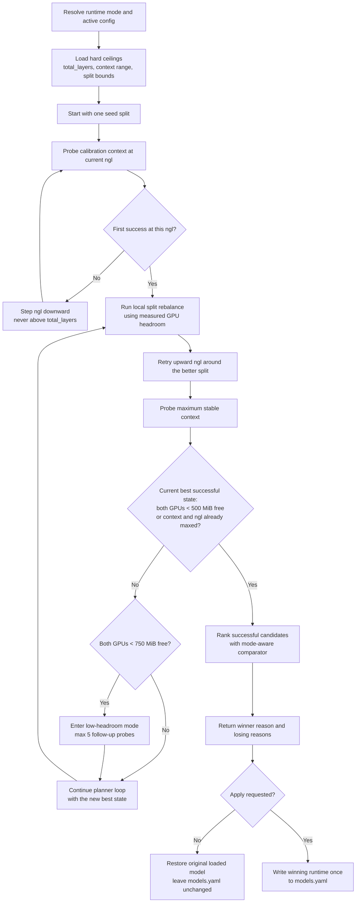

# Guardian Finetune V2 Requirements

## Purpose

In this document, "finetune" does not mean model-weight training, LoRA
training, or checkpoint adaptation. Here it means runtime tuning for one
specific Guardian host.

The finetune flow exists to find the best loadable runtime shape for a model on
this machine:

- highest stable `context` when the operator chooses context-first tuning
- highest stable `ngl` when the operator chooses speed-first tuning
- a `tensor_split` that avoids wasting VRAM on one GPU while the other becomes
   the bottleneck
- separate winning runtime shapes for text and vision when projector overhead
   changes the fit

The intended output is an explainable runtime config that Guardian can validate
live against `/admin/load` and optionally write back to `models.yaml` with
`--apply`. In short: the finetune is meant to answer "what is the best stable
runtime config for this model on this exact host, for this operator goal?"

Guardian's current finetune flow has become too entangled to trust as the source
of truth for runtime tuning. The immediate trigger for a rewrite is the latest
vision rerun for `Qwen3.6-35B-A3B-Heretic-Native-MTP-Preserved`, where the tool
reported `0.50,0.50` as the winning split even though that choice was driven by
the current ranking logic more than by an explicit operator goal.

The concrete failure mode in v1 is straightforward:

- `choose_better_result()` compares `balance_metric()` before it applies the
  requested optimization mode.
- That means a candidate with a more centered split or a smaller VRAM delta can
  outrank the actual requested objective.
- In practice, `context` mode and `speed` mode are therefore not truly
  lexicographic. They are still being pre-filtered by a balance heuristic.

This document defines the target behavior for a clean `finetune v2` rewrite.

## Core Outcome

V2 must produce results that are deterministic, explainable, and mode-aware.
When the tool says a config won, the operator must be able to point to a short,
explicit reason string and see why every other successful candidate lost.

## Hard Requirements

1. `ngl` candidates must never exceed the model's configured `total_layers`.
2. `mmproj` must affect measured fit and GPU headroom, but it must not extend
   the main model's `n_gpu_layers` range.
3. Text and vision tuning must be treated as separate runtime problems.
4. `models.yaml` must stay unchanged during a dry run. Only a final
   `--apply` may write the winning config.
5. Every probe must be appended to the results log immediately so interrupted
   runs still leave an auditable trail.
6. Split balancing is a search heuristic, not a global winner-selection
   override.
7. Failed seed probes must not fan out into alternate splits until that same
   `ngl` has produced at least one successful probe.
8. Candidate ranking must never compare text and vision probes in the same pool.
9. The final winner must include a machine-readable explanation of why it won.
10. Once both GPUs are below `750 MiB` free VRAM, the planner may spend at most
   5 additional follow-up probes trying to get below the final `500 MiB`
   threshold unless the runtime is already at max `context` and max `ngl`.
11. V2 must support fixed `--context` and fixed `--ngl` constraints, while
   `--optimization speed|context` remains the primary steering interface.

## Metadata Rules

### Main model layers

- Each model entry in `models.yaml` must declare `total_layers`.
- V2 must clamp all `ngl` generation and explicit `ngl` inputs to that ceiling.
- If `total_layers` is missing, V2 must fail fast instead of guessing.

### Multimodal projector handling

- `mmproj` is separate GPU-loaded overhead.
- V2 must account for projector cost through measured load success, VRAM
  telemetry, and latency.
- V2 must not treat projector metadata as additional `ngl` layers.
- If future projector formats expose a meaningful stage count, that metadata may
  be logged separately, but it must stay separate from the main model layer
  ceiling unless upstream llama.cpp changes its semantics.

## Split Balancing Contract

- Split balancing exists to move pressure away from the bottleneck GPU, not to
   chase a visually pretty split such as `0.50,0.50`.
- The primary balancing signal must be absolute free MiB on both GPUs after a
   successful probe. Percentages may be logged, but they are secondary.
- A split candidate is only better if it preserves the current required
   `context` and `ngl` while improving bottleneck-GPU headroom or reducing the
   cross-GPU free-VRAM gap.
- Split balancing must never silently lower `context` or `ngl` just to make the
   split look better.
- Split balancing only runs after a successful probe at the current
   `context`/`ngl` state.
- Split balancing must never be computed from a failed probe. Failed probes may
   inform planner direction, but the balancing target is always the latest
   successful runtime state.
- After a successful rebalance, v2 must be allowed to retry higher `ngl` values
   against the improved split instead of assuming earlier failed splits are the
   final word.
- Runtime verification must distinguish the requested tensor split, the
   effective split written to `current_model.args`, and the backend VRAM
   allocation bucket measured from the live `llama-server` process.
- If a requested split changes the effective split but lands in the same backend
   allocation bucket as the previous successful probe, the planner must keep
   stepping in the same measured direction until the bucket changes, a probe
   fails, or split bounds are exhausted. For example, `0.39,0.61 -> 0.38,0.62`
   in the same bucket must queue `0.37,0.63`, not jump back to `0.50,0.50` or
   any unrelated fallback.
- If a requested split does not change the effective split, the probe is invalid
   because the runtime override may have been ignored; that case must fail
   explicitly instead of being treated as a llama.cpp bucket plateau.

### Run completion rule

A successful finetune run is only complete when at least one of these terminal
conditions is true for the current best successful state:

1. Both GPUs have less than `500 MiB` free VRAM.
2. The state is already at the maximum allowed `context` and maximum allowed
   `ngl` for the selected runtime.

If the current best successful state still leaves one GPU above `500 MiB` free
and the selected runtime is not already at both maxima, the planner must keep
searching.

### Low-headroom follow-up budget

- Once the current best successful state leaves both GPUs below `750 MiB` free
   VRAM, the planner enters low-headroom follow-up mode.
- In that mode, the planner may spend at most 5 additional follow-up probes to
   try to reach the final `<500 MiB` convergence target.
- If those 5 follow-up probes are exhausted and the state is still not below
   `500 MiB` on both GPUs, the planner must stop and return the best successful
   state found so far with an explicit budget-exhausted reason.
- This budget does not apply once the runtime is already at max `context` and
   max `ngl`, because that state already satisfies the completion rule.

## CLI Contract

- The default operator interface should be `--optimization speed` or
   `--optimization context`.
- `--optimization context` means: keep `ngl` as high as possible and search for
   the highest stable context, stepping `ngl` downward only when needed.
- `--optimization speed` means: keep context at the active target or floor and
   search for the highest stable `ngl`, stepping context only when that is the
   only way to preserve a valid run.
- A fixed `--context` must pin context and turn the remaining search into
   `ngl` plus split tuning.
- A fixed `--ngl` must pin `ngl` and turn the remaining search into context plus
   split tuning.
- If both `--context` and `--ngl` are fixed, the planner must only validate,
   split-tune, and evaluate convergence for that exact runtime shape.
- `balanced` mode may still exist, but it is secondary to the primary operator
   paths `speed` and `context`.

## Migration and Deprecation Plan

- `scripts/finetune_model_config.py` remains the legacy v1 operator CLI only
   for historical fallback.
- `./finetune_v2.py` is the operator entrypoint. Running it without arguments
   prints the available options, configured models, and aliases; with a model
   name or alias it uses Guardian `/admin/load` runtime overrides for every
   dry-run probe and writes only `data/model_finetune_v2_results.json` unless
   `--apply` is provided.
- `scripts/finetune_v2_model_config.py` remains as a compatibility wrapper for
   the root entrypoint.
- Operators should run v2 first with fixed `--context` or fixed `--ngl` when
   validating parity against a known v1 result, then use
   `--optimization speed|context` for exploratory tuning.
- V1 should remain available only for fallback until live text and vision v2
   runs on the target host produce auditable winners with no regression. Once
   that parity is confirmed, the v2 CLI can become the default operator path and
   v1 should be treated as deprecated.

## Optimization Modes

### `context`

`context` mode is lexicographic. The winner is chosen in this exact order:

1. Highest stable context.
2. Highest stable `ngl` at that context.
3. Best measured bottleneck-GPU headroom.
4. Lowest total probe time.
5. Stable deterministic tie-breaker.

Important rule: a more balanced-looking split must never beat a higher-context
or higher-`ngl` result just because it is closer to `0.50,0.50`.

When `--ngl` is not fixed, `context` mode should begin from the maximum allowed
`ngl` and only step downward when needed to unlock more stable context.

### `speed`

`speed` mode must optimize for runtime speed at or above a required context
floor.

The winner is chosen in this order:

1. Highest stable `ngl` that meets the active context floor.
2. Lowest total probe time.
3. Highest stable context.
4. Best measured bottleneck-GPU headroom.
5. Stable deterministic tie-breaker.

The default context floor should be the currently configured runtime context for
the selected mode unless the CLI explicitly overrides it.

When `--context` is fixed, `speed` mode must keep that context pinned and search
only for the best `ngl` and split combination around it.

### `balanced`

`balanced` mode is the only mode allowed to use a combined score.

Requirements:

1. The score formula must be explicit and documented in code and CLI output.
2. The score must be applied only after invalid or below-floor candidates are
   removed.
3. The score must not silently fall back to `distance from 50/50` as a proxy
   for overall quality.

## Search Flow

### Context mode search flow

1. Resolve the runtime mode (`text` or `vision`) and load its active config.
2. Resolve hard ceilings: `total_layers`, context search range, split bounds,
   smoke shape, and current runtime fields.
3. Start from one seed split only.
4. At a fixed calibration context, walk `ngl` downward until the first success.
5. Only after that success, run localized split rebalance using measured GPU
   headroom from the latest successful probe.
6. After a successful rebalance, retry upward `ngl` values around that better
   split before assuming the earlier lower-`ngl` state is the best reachable
   offload level.
7. With the best successful `ngl` plus split state so far, search the maximum
   stable context.
8. Repeat the balance and local `ngl` retry loop until the current best
   successful state either leaves both GPUs below `500 MiB` free VRAM or is
   already at max `context` and max `ngl` for that runtime.
9. If both GPUs are already below `750 MiB` free but not yet below `500 MiB`,
   cap the remaining follow-up search to 5 additional probes.
10. Choose the final winner with the `context` comparator defined above.

### Vision mode specifics

- Vision tuning must always run with the projector path active.
- Vision results must be stored separately from text results.
- The search plan must acknowledge that projector cost changes fit and latency,
  but not `total_layers`.

### Explicit candidate mode

If the operator passes explicit `ngl` or split candidates:

- `ngl` values must still be clamped to `total_layers`.
- Duplicate candidates must be removed after clamping.
- Explicit candidates must still be ranked by the same mode-aware comparator.

If the operator passes fixed `--context` and/or fixed `--ngl`:

- Fixed `--context` pins context.
- Fixed `--ngl` pins `ngl`.
- If both are fixed, only split tuning, smoke validation, and convergence checks
   remain in scope.

## Ranking and Explainability

The diagram above is intentionally strict: split rebalancing only begins after a
successful probe at the current `ngl`, the planner may retry upward `ngl` after
that rebalance, and the final winner is chosen by the requested mode comparator
instead of by a hidden balance-first override.

V2 must separate these concerns:

- Search heuristic: what to try next.
- Acceptance: did the candidate load and pass smoke.
- Ranking: which successful candidate wins.

The results log must record:

- Probe order.
- Comparator mode.
- Winner reason.
- Losing reason for each successful candidate that was rejected.
- VRAM telemetry source (`pre_load`, `post_smoke`, or unavailable).
- Whether the probe was live or cache-backed.

## State Management Rules

1. The active working candidate must live in memory, not in `models.yaml`.
2. `models.yaml` may only be written once at the end of a successful `--apply`.
3. Failures, crashes, or Ctrl-C must leave the config file unchanged.
4. The original loaded model must be restored unless the operator explicitly
   opts out.

## Code Structure Goals

V2 should be split into small, testable parts instead of one sprawling control
module.

Suggested boundaries:

- `metadata.py`: resolve runtime metadata, ceilings, and smoke shape.
- `planner.py`: generate the next candidate based on mode and prior outcomes.
- `probe_runner.py`: perform load + smoke + VRAM capture.
- `ranking.py`: mode-aware comparators and winner explanations.
- `persistence.py`: result logging, caching, and final apply behavior.
- `cli.py`: argument parsing and operator-facing summaries.

The public entrypoint can still expose one orchestration class, but the logic
must be decomposed behind it.

## Acceptance Criteria

V2 is not done until all of the following are true:

1. A regression test proves `context` mode does not let split balance override
   higher context or higher `ngl`.
2. A regression test proves no probe is ever attempted with `ngl > total_layers`.
3. A regression test proves `mmproj` does not change the `ngl` ceiling.
4. A regression test proves split balancing can retry upward `ngl` after a
   successful rebalance instead of treating the first lower-`ngl` success as
   final.
5. A regression test proves the low-headroom mode caps remaining follow-up
   probes at 5 once both GPUs are below `750 MiB` free but not yet below
   `500 MiB`.
6. A regression test proves fixed `--context` and fixed `--ngl` pin those
   dimensions while `--optimization speed|context` drives the remaining search.
7. A dry-run failure leaves `models.yaml` byte-identical.
8. A live run is only marked complete when both GPUs are below `500 MiB` free
   or the winning state is already at max `context` and max `ngl`.
9. A live Qwen vision replay can explain why the winning split won without
   relying on "closer to 50/50" as the hidden primary reason.

## Rewrite Strategy

1. Freeze v1 behavior and stop layering more heuristics into it.
2. Build the mode comparators and planner as pure functions first.
3. Add unit tests for the comparator contract before wiring live Guardian probes.
4. Reintroduce live probing only after the ranking contract is stable.
5. Keep cache reuse optional until correctness is proven.

## Open Decisions

1. Whether `speed` mode should accept an explicit `--context-floor` flag in v2
   or only derive that floor from the active runtime config when `--context` is
   not fixed.
2. Whether `balanced` mode should optimize on load+smoke wall time alone or on a
   combined latency-plus-headroom score.
3. Whether v2 should preserve the current results JSON shape or write a new v2
   schema with explicit winner-reason fields.