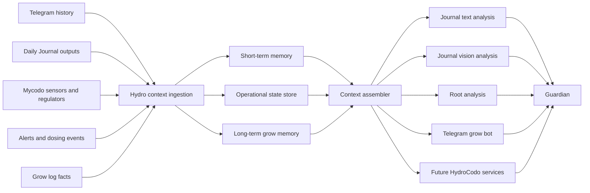

# Hydro Context Architecture

Prepared: 2026-05-20
Status: Proposed

## Goal

Provide all hydro-facing LLM consumers with a compact, relevant, structured context package instead of only the latest Daily Grow Journal digest.

Target consumers:

- Daily Grow Journal text analysis
- Daily Grow Journal vision analysis
- Root analysis workflows
- Telegram grow assistant / grow bot
- Future HydroCodo services

## Design Principles

- Keep Guardian generic. It should remain the local model gateway, not the hydro memory database.
- Store structured records, not giant prompt blobs.
- Build one reusable context assembler for all hydro consumers.
- Bound token usage explicitly per consumer profile.
- Prefer summaries, snapshots, and ranked facts over raw history dumps.
- Keep short-term, operational, and long-term memory separate.

## Recommended Architecture

Use a separate hydro context layer that sits beside Mycodo and Telegram integrations, then sends curated prompt payloads into Guardian.

Recommended shape:

## Memory Layers

### 1. Short-Term Conversation Memory

Purpose:

- Preserve the recent Telegram exchange and recent operator/assistant turns.
- Let the bot remember the active conversational thread without replaying an entire chat log.

Store:

- Last N Telegram user turns
- Last N Telegram assistant turns
- Last N direct operator replies that materially change decisions
- Rolling conversation summary for anything older than the live window

Recommended retention:

- Raw window: last 8 to 20 turns, consumer-dependent
- Rolling summary: last 3 to 7 days of important conversation state

### 2. Recent Operational State

Purpose:

- Represent what the grow system is doing now and what happened recently.
- Keep state machine, anomalies, regulator truth, and sensor trends easy to query.

Store:

- Sensor summaries for last 24h and 72h
- Current regulator state and target setpoints
- Open warnings and unresolved incidents
- Recent dosing events and actuator actions
- Camera / journal-derived last known observations

Recommended retention:

- High-resolution event timeline: 72h
- Bucketed operational summaries: 7 to 30 days

### 3. Long-Term Grow / Project Memory

Purpose:

- Preserve durable facts that should survive chat resets and daily digest turnover.

Store:

- Grow phase history
- Reservoir and hardware changes
- Calibration facts
- Persistent plant health facts
- Cultivar / strain notes
- Known recurring issues and mitigations
- Explicit grow-log facts and milestone dates

Recommended retention:

- Entire grow run
- Cross-run lessons if marked reusable

## Structured Memory Objects

Do not store one giant text blob. Use typed records.

Suggested canonical objects:

- `TelegramTurn`
  - `id`, `timestamp`, `role`, `channel`, `text`, `attachments`, `tags`, `thread_id`
- `JournalEntry`
  - `id`, `timestamp`, `digest`, `vision_summary`, `text_summary`, `action_items`, `run_id`
- `SensorBucketSummary`
  - `metric`, `window`, `min`, `max`, `avg`, `slope`, `volatility`, `out_of_range_pct`
- `RegulatorSnapshot`
  - `timestamp`, `reservoir_state`, `phase`, `target_ranges`, `controller_outputs`, `overrides`
- `IncidentRecord`
  - `id`, `opened_at`, `status`, `severity`, `category`, `summary`, `latest_evidence`, `owner`
- `DosingEvent`
  - `timestamp`, `pump`, `dose_ml`, `recipe_component`, `reason`, `result`
- `GrowFact`
  - `id`, `fact_type`, `value`, `confidence`, `source`, `effective_from`, `effective_to`
- `ContextPackage`
  - `consumer`, `generated_at`, `conversation`, `operations`, `memory`, `budget`, `rendered_prompt`

## Context Assembler

The assembler should gather candidate records, score them for relevance, compress them, and emit a bounded context package.

Inputs to select from:

- Last N Telegram turns
- Last N Daily Journal outputs
- Last 24h sensor summaries
- Last 72h sensor summaries
- Current regulator truth
- Open incidents and warnings
- Recent dosing events
- Grow-log facts and current run facts

Selection rules:

- Always include current regulator truth.
- Always include unresolved incidents above a severity threshold.
- Prefer summaries over raw samples.
- Include only the latest conversation window plus a rolling summary.
- Include only anomalies and trends that matter to the target consumer.
- Deduplicate facts already represented in the current operational snapshot.

Compression rules:

- Convert dense sensor streams into bucket summaries before prompt assembly.
- Collapse repeated Telegram back-and-forth into a rolling summary.
- Promote only durable observations into long-term memory.
- Keep event lists capped by recency and importance.

## Consumer Profiles

Each consumer should get a different bounded package.

### Daily Grow Journal Vision Analysis

Include:

- Current grow phase
- Last 24h sensor summary
- Current regulator snapshot
- Last 1 to 3 journal observations
- Open incidents
- Minimal recent Telegram context only if directly relevant

Budget target:

- 2k to 4k input tokens before the image payload

### Daily Grow Journal Text Analysis

Include:

- Last 24h and 72h summarized trends
- Current regulator truth
- Open incidents and recent dosing
- Last 1 to 3 journal outputs
- Short recent operator conversation context

Budget target:

- 4k to 8k input tokens

### Root Analysis

Include:

- Extended trend summaries
- Recent anomalies and dosing history
- Journal history summary
- Relevant long-term grow facts
- Recent operator conversation summary

Budget target:

- 6k to 12k input tokens

### Telegram Grow Bot

Include:

- Last N Telegram turns
- Current regulator truth
- Current alerts
- Most recent journal conclusion
- Only the specific grow facts needed to answer the current question

Budget target:

- 2k to 5k input tokens

### Fast Watchdog / Alert Explainer

Include:

- Current alert
- Last few relevant sensor buckets
- Current regulator snapshot
- One-line prior similar incident summary if available

Budget target:

- 1k to 2k input tokens

## Model Routing Recommendation

Split routing by job type instead of forcing one model to do everything.

### Vision Model

Use for:

- Plant image review
- Journal photo interpretation
- Visual anomaly checks

Requirements:

- Stable mmproj runtime
- Low hallucination tendency on plant-state observations
- Small bounded textual context plus image input

### Text Reasoning Model

Use for:

- Daily journal synthesis
- Root-cause reasoning
- Cross-signal interpretation
- Advice generation and follow-up planning

Requirements:

- Strong reasoning
- Good performance on structured telemetry summaries
- Larger but still bounded context windows

### Fast Watchdog Model

Use for:

- Alert triage
- Quick classification
- Retry-safe watchdog summaries
- Cheap Telegram replies when full reasoning is unnecessary

Requirements:

- Low latency
- Cheap context footprint
- Predictable output schema

## Implementation Phases

### Phase 0: Stabilize Guardian Vision Runtime

- Keep `Qwen3.6-35B-A3B-Heretic-Native-MTP-Preserved` vision runtime on the validated `262144 / 36 / 0.55,0.45` shape.
- Keep crash details exposing effective runtime config.
- Add a dedicated health probe or smoke check for vision runtime loads.

### Phase 1: Define Canonical Memory Schemas

- Create structured schemas for `TelegramTurn`, `JournalEntry`, `SensorBucketSummary`, `RegulatorSnapshot`, `IncidentRecord`, `DosingEvent`, and `GrowFact`.
- Decide canonical storage backend: SQLite/Postgres preferred over ad-hoc files.
- Add ingestion timestamps, source metadata, and stable IDs.

### Phase 2: Build Ingestion Pipelines

- Telegram ingestion: persist incoming and outgoing turns.
- Daily Journal ingestion: persist digest, vision result, text result, and extracted action items.
- Sensor summarizer: roll raw Mycodo history into 24h / 72h bucket summaries.
- Incident pipeline: translate alerts, anomalies, and dosing side effects into structured incidents.

### Phase 3: Build Context Assembler

- Implement `ContextAssembler.build(consumer, query, budget)`.
- Rank candidate records by recency, severity, and relevance.
- Emit both structured JSON and a compact rendered prompt section.
- Add deterministic token caps per consumer profile.

### Phase 4: Integrate Consumers

- Wire Daily Grow Journal text analysis to the assembler.
- Wire Daily Grow Journal vision analysis to the assembler.
- Wire Telegram bot replies to the assembler.
- Wire root-analysis workflows to the assembler.

### Phase 5: Add Memory Promotion And Summarization

- Promote durable facts from repeated incidents or journal entries into long-term memory.
- Maintain rolling conversation summaries.
- Maintain rolling 24h / 72h operational summaries.

### Phase 6: Add Observability

- Log which context package was built, at what token budget, and from which sources.
- Record which records were selected or dropped.
- Expose package sizes and selection counts in metrics.
- Keep per-consumer latency and token budget dashboards.

## Risks And Tradeoffs

- If raw history is injected directly, token usage will explode and relevance will collapse.
- If memory is stored only as freeform text, reuse across consumers becomes brittle.
- If Guardian itself becomes the hydro memory store, the proxy layer will become domain-coupled and harder to maintain.
- If the vision path depends on fetching remote image URLs at inference time, reliability will be worse than using local data URLs or uploaded bytes.
- If long-term memory is promoted too aggressively, stale facts will contaminate current recommendations.

## Recommended Placement

Preferred:

- A separate shared `hydro_context` package or service used by Mycodo functions, Telegram tooling, and future HydroCodo services.

Acceptable fallback:

- A dedicated module tree outside Guardian proxy internals, for example `app/hydro_context/`, if keeping it in this repository is operationally simpler.

Avoid:

- Embedding hydro-specific memory selection directly into `app/proxy/server.py`.
- Using one giant prompt template with raw logs pasted into it.